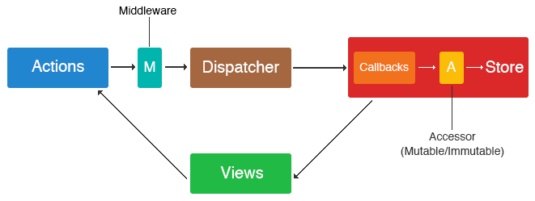

## 数据流的概念

**一些概念名词**

1. store：数据中心，数据最终存储的位置（架构体系中的逻辑位置）
2. mutable/ immutable
3. action: 更新数据的唯一途径（这是约束）
   1. actionType: 用于标识action
   2. payload：装载 的数据（需要处理的数据）
4. dispatcher：分发者，负责连接 action 和 store
5. action middleware： 在由action传送到store的过程中，可以添加一些middleware用于处理payload

**RxJS：**
1. Observable
   1. Observable.of
   2. Observable.from
2. 数据拉取和推送
   1. 订阅模式属于数据拉取（每次拉取都是重新获取数据）；
   2. vue.js中的计算属性，看上取属于拉取，但实际上是推送（在框架内部，分析依赖关系，缓存计算结果，只有依赖变更才会重新计算）；
3. watch， 监听数据变化；在数据变更链路较长时，不适合采用watch模式，计算过程消耗成本较高

MVVM的结构示意图：
>  ------ Fetch ------------->
>  |                           |
> View  <--  VM  <--  M  <--  RESTful
>                     ^
>                     |  <--  WebSocket

### 数据订阅模式存在的一个问题
如果一个视图View依赖较多的数据源，就需要添加许多订阅。如果订阅的数据之间存在关联关系，这会不可避免地增加逻辑的复杂性。

数据的监听不仅有横向的维多（多个数据源），也许还会存在纵向维度（同一个数据的前后的变化）。

***那么如何解决这个问题呢?***
TODO: 

### 单项数据流与双向绑定

### 数据驱动的两个不适合
1.  render中不应该存在改变数据的操作；
2.  对渲染时机有要求的场景（在数据驱动模式下， view的渲染时机没有自主权无法精确控制）

