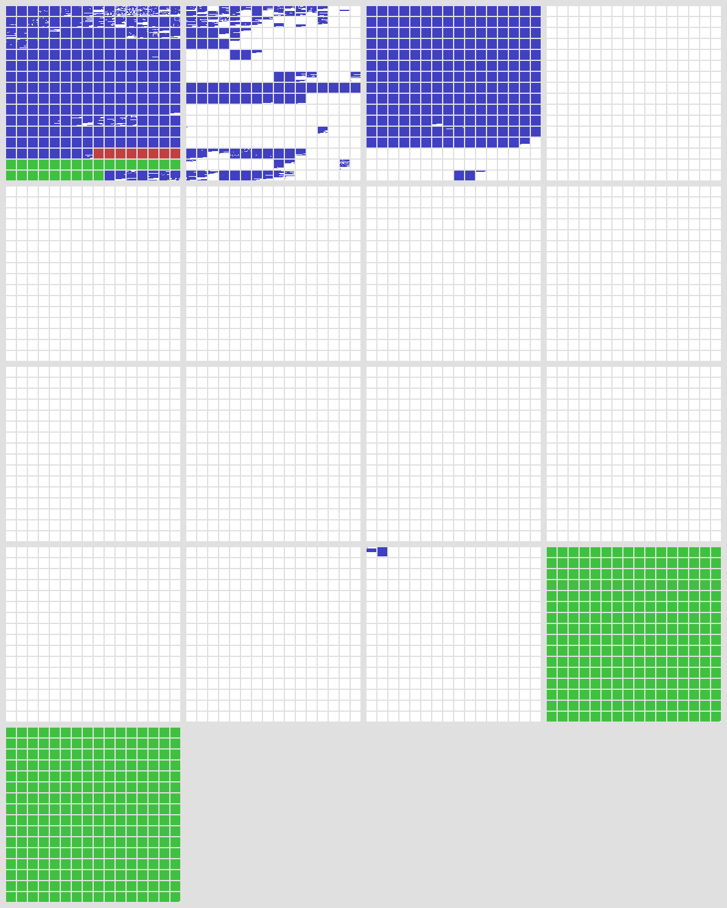
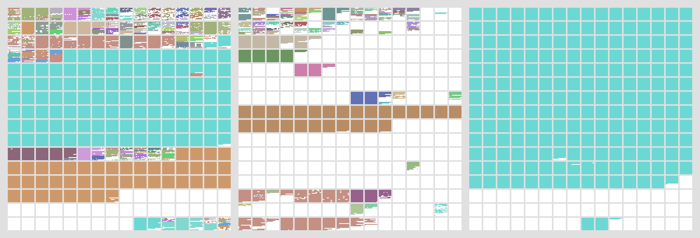

## Function.prototype上的call and apply

[实现call和apply](https://blog.usejournal.com/implement-your-own-call-apply-and-bind-method-in-javascript-42cc85dba1b)

## Unicode

[A Programmer’s Introduction to Unicode](http://reedbeta.com/blog/programmers-intro-to-unicode/)

### unicode编码空间示意图

### unicode编码常用语言字符编码空间示意图：
