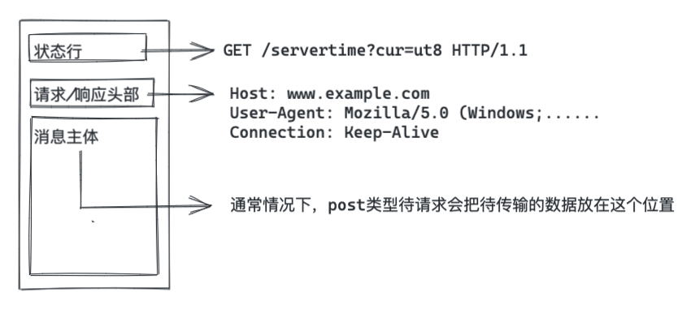

## HTTP协议的基本构成

HTTP协议的本质是一份纯文本内容，里面以空行划分为三部分内容：

- 网络请求状态行（Method Path http版本号）
- 网络请求头
- 网络请求传输的数据 通常也称为 body



HTTP协议内容构成比较简单，更多需要了解的其实是请求头。为什么说它重要呢，这是请求双方用来进行协商定义的内容。

换个更通俗的说法，如果把一次http请求当作一次交易：

- 状态行用于寻找你要交易的对象；
- 请求头是沟通双方用来进行讨价还价的环节；
- 第三行就等于买卖谈妥进行发货的过程（当然了，也许是虚拟商品，那就没有这次发货。对应GET请求）；

## 除了GET/POST请求还有哪些方法

HTTP定义的请求方法（Method）类型：
- [x] GET 
- [x] HEAD 
- [ ] OPTIONS
- [ ] POST 
- [ ] PUT  
- [ ] DELETE
- [ ] TRACE
- [ ] CONNECT    

> 摘引自[rfc2616#sec5.1.1](https://www.w3.org/Protocols/rfc2616/rfc2616-sec5.html#sec5.1.1)

不一一说明每个方法的含义，想了解更多的话可以参考规范（[rfc2616-sec9](https://www.w3.org/Protocols/rfc2616/rfc2616-sec9.html#sec9.3)）

但是`OPTIONS`方法有必要讲一下。先说下它能干什么。

1. 在用于获取目标资源（URL）所支持的通信选项；
2. 如果URL为“*”，则测试到服务器到网络性能，类似于ping命令

在某些场景下，浏览器会在正式请求前，增加一次请求用于检验待访问的资源支持哪些选项。这次请求被称做“preflight”。浏览器在进行这次请求时使用的方法通常`OPTIONS`。

比较常见的使用场景就是`CORS`（Cross-origin resource sharing：跨域资源共享）。这是一种允许AJAX跨越同源策略进行请求的解决方案。在实际应用中，需要浏览器和服务端同时支持。具体过程如下：

1. 浏览器检查发起的HTTP请求；
2. 如果该请求触发了同源策略，则浏览器自动增加一次preflight；
3. 服务器在接收到preflight后，根据客户端的信息做出响应；
4. 浏览器检查服务器的response信息，如果服务器允许这次跨域请求，则浏览器进行正式请求；否则直接打断本次跨域请求；

对于用户而言，这次preflight是无感知的。

## 关于HTTP协议的状态行

状态行分为request和response，二者的内容有些许差别。

request的状态行：
```
POST /some/path HTTP/1.1
```
response的状态行：
```
HTTP/1.1 200 OK
```

response的状态行里除去最前面的协议版本，后面是此次请求的状态码和状态码短语。

常见的一些状态码及其含义：

|code | description |
|:-------:|:--------|
| 200 | OK请求成功 |
| 206 | 返回部分内容 |
| 301 | 永久性重定向 |
| 302 | 临时性重定向 |
| 304 | 请求内容没有变更（意味着可以使用缓存） |
| 400 | 请求的报文存在格式或这内容问题，服务器无法处理 |
| 401 | 无法认证当前用户 |
| 403 | 无权限 |
| 404 | 当前请求的路径不存在 |
| 405 | 请求的Method不支持 |
| 500 | 服务器内部错误 |
| 502 | 网关问题 |
| 503 | 服务不可用 |

## 一个之前一直被讨论的问题

> post和get的区别？

从传输内容的角度看，二者没有区别。post能做的事情，get一样也可以做到。为什么？因为post也好，get也好都只是对当前请求的一种声明性的描述，没有任何强制约束力。至于在实际应用中，可能会发现例如“当前请求不支持get”之类的问题。其实这个限制在HTTP协议中并未说明，而只是应用方（服务器）自定义的一种信息。

**如果HTTP对使用的方法不做限制，那为什么还要定义这些methods？**

为了标明此次请求的目的，应该使用不同的method来简单明了但说明。但是仅仅是一种建议，没有任何强制性要求。这样做只是为了是请求带有语义，利于开发者维护。

**既然本质一样，是否可以不用刻意区分？**

答案：还是要区分。

从HTTP但角度看，POST和GET没有区别。但是具体到HTTP但应用程序（例如浏览器）针对不同的Method做了不同的处理。比如，浏览器会缓存GET请求，但是不会缓存POST诸如此类但差别。所以从实际开发但角度讲，还是有必要区分这二者的。

下面列举一些GET/POST在浏览器中但区别：

| | GET | POST |
|:----:|:-----:|:---------:|
| 后退按钮/刷新  |	无害 |	数据会被重新提交（浏览器应该告知用户数据会被重新提交） |
| 书签 |	可收藏为书签 |	不可收藏为书签 | 
| 缓存 |	能被缓存 |	不能缓存 | 
| 编码类型 |	application/x-www-form-urlencoded |	application/x-www-form-urlencoded 或 multipart/form-data。为二进制数据使用多重编码 |
| 历史 |	参数保留在浏览器历史中 |	参数不会保存在浏览器历史中 |
| 对数据长度的限制 |	是的。当发送数据时，GET 方法向 URL 添加数据；URL 的长度是受限制的（URL 的最大长度是 2048 个字符）| 	无限制| 
| 对数据类型的限制 |	只允许 ASCII 字符。| 	没有限制。也允许二进制数据 | 
| 安全性 |	 与 POST 相比，GET 的安全性较差，因为所发送的数据是 URL 的一部分。在发送密码或其他敏感信息时绝不要使用 GET ！| POST 比 GET 更安全，因为参数不会被保存在浏览器历史或 web 服务器日志中 |
| 可见性 |	数据在 URL 中对所有人都是可见的 | 	数据不会显示在 URL 中 |

## HTTP通信的过程

### HTTP通信过程中，存在的一些问题

## HTTP/2
