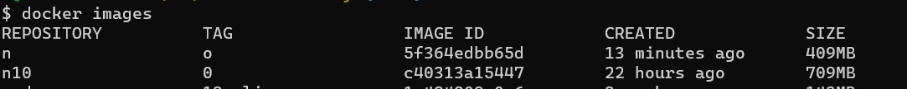
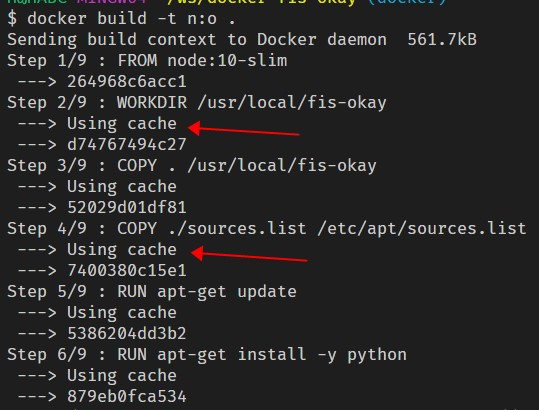

# Docker 第一次上手

## 引言

1. DevOps/开发运维/不懂运维和部署的前端开发
2. 项目实际需要，平稳升级构建工具


## 安装Docker
去看官网就好了

## 涉及的几个命令
1. docker images
    
2. docker build
    1. -t 指定image的repository 和 tag， 这两项的含义可以看`docker images`命令之后的输出结果，在docker build时，可以同时指定多个`-t`选项
3. docker run
    1. -v 挂载宿主机目录/本地目录到镜像中

### docker run
``` bash
docker run [options] image  [command] [args]
```

## 构建镜像/ Dockerfile

### 先看看Dockerfile的一个示例：
``` dockerfile
# 指定当前镜像的基础镜像，下面这行指定当前以node:8-slim构建，这个镜像是官方仓库提供的，
FROM node:10-slim

# 指定镜像的工作目录
WORKDIR /usr/local/workdir

# 拷贝文件 将from拷贝到 /usr/local/workdir
COPY from /usr/local/workdir

# 构建镜像时，在镜像内执行的指令
RUN npm i -g . --registry=https://registry.npm.taobao.org/

# 指定在容器内运行的命令
CMD ["ls"]
```
除了上面示例中的几个常用指令，Dockerfile中还有下面这些：
- EXPOSE
- ENV
- ADD
- ENTRYPOINT
- VOLUME
- USER
- ONBUILD

关于如何写好一个Dockerfile的建议，可以参考[Best practices for writing Dockerfiles](https://docs.docker.com/develop/develop-images/dockerfile_best-practices/)
## 遇到的几个问题

### 1. 镜像中的文件不会被更改
`docker run`命令不会修改镜像中的文件，当下次执行`docker run`的时候，上次的结果不会保留。
### 2. 构建镜像会有缓存，
如果在构建过程中，某一步骤失败，则它前面的步骤会被缓存下下来。在下次重新构建时，这些步骤不再执行。

### 3. container 和 image的关系
image可以看作一个特定环境的文件的组合；image是静态的，可以在不同的机器和操作系统之间来回转移；
container则是这个环境的具体执行实例；contaier是动态的，跟当前环境密切相关；当某个机器启动一个image时，就产生了一个container。