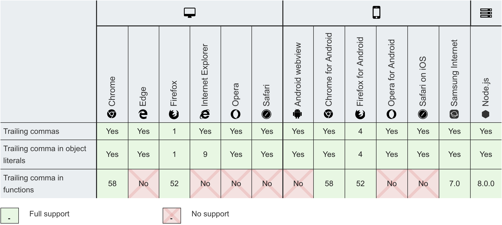
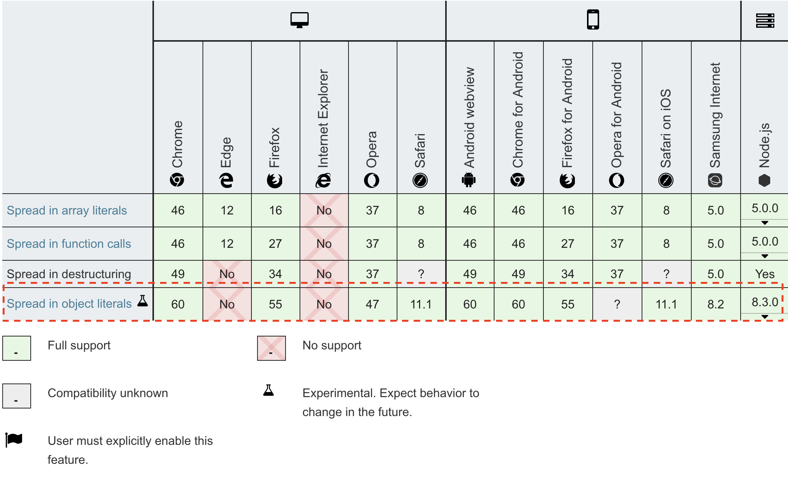
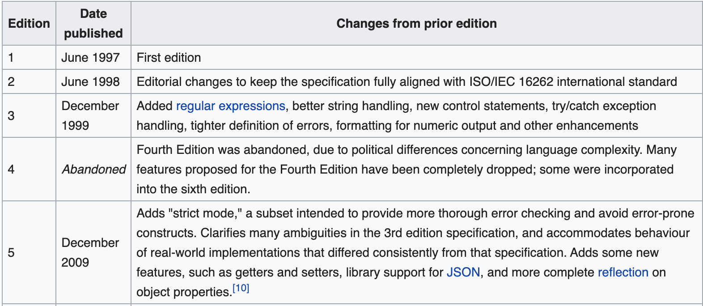

# 关于ES6, ES7, ES10，你真的了解吗


**什么是 JavaScript？**根据维基百科，它是符合ECMAScript规范的脚本语言。ES6、ES7等，你可能听说过这些名词，你很可能也使用 ES6 一段时间了（在许多情况下借助Babel）。

我相信你们大多数人在使用许多ES6中的新特性时，而不会问自己：这真的是ES6吗？，这是否仍然是一个浏览器不支持功能？我们对Babel转译的了解有多少，又有多少不了解？你否已经更新了有关ES中内容的知识？自从ES6的第一个提案以来，有哪些内容已删除？自最初的ES7提案以来，又添加了哪些内容？

因为我相信每个人都关心当我们何时可以在JS中使用`replaceAll`函数，让我们坐下来回顾一下ES当前的状态。从Babel和ES6的诞生以来，哪些已经被写到规范中？读完本文后，你将成为 ES-10/10！（对不起，这是我最好的一个！）

## 一些历史和科普
让我们准备回到过去吧！如果你和我一样，第一次听说ES6和Babel是在2014-2015年左右，你很可能仍然认为事情或多或少在同一个地方。这已经足够公平了，因为多亏了Babel，我们很少关心幕后到底发生了什么。但是，正如你想象的那样，Babel 允许我们使用这些"proposal stage"功能，这些功能在可用之前，在 5 年内没有保持"建议阶段"功能。

为了在撰写本文时停止使用引号引起来的"建议阶段"（在键入时很难用引号引起来），最好让你了解JS不同阶段的功能是很重要的。


从本质上讲，这些功能会经历0到4四个阶段，阶段0是最早的阶段，阶段4 是"随时可以发布"。


阶段 0 是某人的纯粹想法，它被整理到建议阶段(Stage 1)，经过审查和讨论，然后到达第3阶段，最终被优先放到第4阶段。一旦功能达到阶段4，它将在浏览器中实现并计划发布。

在这里获取所有信息：[https://tc39.es/process-document/](https://tc39.es/process-document/)


## ES6 和 ES7 —— 提醒
我不是想要取笑你，再写一篇ES6的介绍。。。。。。但实际上，我会这样做。简而言之，ES6（或ES2015）是根据2015年里程碑通过阶段4的一批功能。换句话说，如果你对ES6有很好的了解和对ES7的一些了解，你还有4年左右的年头赶上...不要有压力。

让我们来看看什么是ES6的正式部分。顺便说一下，所有这些功能都支持跨浏览器。换句话说，你可以不需要Babel的情况下，来使用它们中的任何一个（除非你想要支持 IE11，因为IE11对ES6的支持不是很完善）。

在**ES6**中，我们有：

创建和继承类的能力。

```js
class MyComponent extends React.Components {

}
```

ES6模块，具有导入和导出功能。

```js
import * from 'React';
export default MyComponent;
```

生成器 Generators
```js
let fibonacci = {     
  *[Symbol.iterator]() {         
    let pre = 0, cur = 1         
    for (;;) { 
      [ pre, cur ] = [ cur, pre + cur ]
        yield cur
    }
  }
}
```

我们还有： 模板，箭头函数，Promise，新的数字类型，Const/Let，类型化数组，数组解构，Map/Set，Symbol。

此处有所有功能列表：[http://es6-features.org](http://es6-features.org)


> 你注意到了吗？修饰器Decorators，对象解构（如 React props:{...props}）等不是ES6的一部分！

关于ES7（ES2016），下面是新增的部分。这是一个相当小的更新：

1. [指数运算符](http://ecma-international.org/ecma-262/7.0/#sec-applying-the-exp-operator) `base ** exponent`
2. 数组includes方法 `array.includes(myItem) // true or false`

来源：[http://ecma-international.org/ecma-262/7.0/](http://ecma-international.org/ecma-262/7.0/)

> 您可能已经注意到，async/await不是ES7的一部分，事实上它属于ES8！

## ES8，ES9，ES10

在过去两年中，每个接受过JavaScript面试的人，至少被问到1671次ES6是什么，以及它带来了什么功能。但有人注意到，JS显然没有突然停止在ES6或ES7。然而，没有人问你关于它？这是一个你做好事情的的机会！

在**ES8（ES2017）**中，以下是可用的功能：

1. Object.entries / Object.values（数组的值/键等价于objects）
2. 字符串补足方法 `myString.padStart(2); // or padEnd`
3. 尾后逗号(终止逗号)`function test(a,b,c, ) // notice the comma after c`
4. 原子和共享内存：[https://developer.mozilla.org/en-US/docs/Web/JavaScript/Reference/Global_Objects/Atomics](https://developer.mozilla.org/en-US/docs/Web/JavaScript/Reference/Global_Objects/Atomics)

当然还有 Async/Await 函数：

```js
async MyAjaxGetCall(url) {
  return ajax.get(url)
}
const response = await MyAjaxGetCall("/getUsers");
console.log(response) // response is available without using promise.then
```

现在你应该知道：除了一些小的例外，这些功能处于阶段4，你可以在不借助 Babel 的情况下，在浏览器中使用它们（也就是说，ES8 是 ES2017，它仍然是最新的， Edge 和 Opera 之类的引擎对某些实现滞后了一点）。



现在转到 **ES9**。就像 ES8 和 ES6 一样，ES9（或ES2018）是一个相当重要的更新：

1. 解除模板字面量限制（[https://tc39.es/proposal-template-literal-revision/](https://tc39.es/proposal-template-literal-revision/)）。现在，允许在模板中使用复杂的语法（例如：LaTex）
2. 异步迭代器：可以将迭代器用于异步操作，例如读取 HTTP 流（[https://tc39.es/proposal-async-iteration/](https://tc39.es/proposal-async-iteration/)）以及引入 `for-wait-of`
3. Promise.finally：[https://github.com/tc39/proposal-promise-finally](https://github.com/tc39/proposal-promise-finally)
4. 对象解构。是的，你已经用了很多年了，但它是一项 ES9功能。来自非 react 开发人员的提醒：它允许你：`myNewObject = {a,b,c,...object}`
5. 还包括 [unicode 转义](https://github.com/tc39/proposal-regexp-unicode-property-escapes#ecmascript-proposal-unicode-property-escapes-in-regular-expressions)和对正则表达式的改进（[https://github.com/tc39/proposal-regexp-lookbehind](https://github.com/tc39/proposal-regexp-lookbehind) ，[https://github.com/tc39/proposal-regexp-named-groups](https://github.com/tc39/proposal-regexp-named-groups)）和 [https://github.com/tc39/proposal-regexp-dotall-flag](https://github.com/tc39/proposal-regexp-dotall-flag)）。


最后，来到**ES10**（或ES2019）！

1. Array.flat：`[[1,2],3]).flat() // [1,2,3]`
2. Array.flatMap：等效于 map().flat()
3. Object.fromEntries: ：Object.entries的反向操作（[查看此处](https://developer.mozilla.org/en-US/docs/Web/JavaScript/Reference/Global_Objects/Object/fromEntries))
4. String.trimStart() & String.trimEnd()）：删除字符串中的多余空格
5. 可选Catch 绑定：删除向捕获添加参数的需要（现在您可以这样写 `catch {}`而不必须这么些` catch(e) {`
6. 让Function.toString具有一致的行为🥳🥳🥳
7. [符号说明](https://developer.mozilla.org/en-US/docs/Web/JavaScript/Reference/Global_Objects/Symbol/description)
8. BigInt =任意大数([](https://developer.mozilla.org/en-US/docs/Web/JavaScript/Reference/Global_Objects/BigInt))（感谢[@redeyes2015](http://twitter.com/redeyes2015)更正）
9. 改进 JSON.stringify()对Unicode的支持
10. 如果键相等，Array.sort 现在保留原始顺序
```js
const array = [
 {key: 2, value: 'd'},
 {key: 1, value: 'a'},
 {key: 1, value: 'b'},
 {key: 1, value: 'c'},
];
array.sort(...)
/*
[
 {key: 1, value: 'a'},
 {key: 1, value: 'b'},
 {key: 1, value: 'c'},
 {key: 2, value: 'd'},
]
*/
```
11. 使JavaScript 成为 JSON 的超集（[此处](https://github.com/tc39/proposal-json-superset)有详细介绍)

### ES5呢？
如果 ES6是ES2015，而ES7是ES2016，你能猜出ES5的年份是什么吗？
...你输了！（除非你真的知道，但既然我没听见，就假设你输了）。ES5是ES2009！
它不止于此，在ES5之前，上一次ES更新是在1999年！

正如您所看到的，从97到 99，更新非常频繁，在之后对16年中，ES5是唯一的更新！


我们如何解释这个问题呢？嗯，在我看来，这有两个因素。第一个是技术性的：JavaScript弱爆了。老实说，确实如此。当时，我们有一些JS的替代方案：Java Applets、ActiveX，甚至Flash。

直到2011年（当Chrome开始出现）不仅这些技术比JS快一个数量级，而且他们也已经拥有了大多数的功能，而这些共功能，JS还在努力实现中。（Java 具有所有语言功能，如类和修饰器，支持多线程、OpenGL、套接字等。当Chrome和谷歌进入市场，并在2013年宣布Java出局（Flash紧随其后），让JS追赶竞争对手的征战开始。两年后，我们家门口有了ES6。

第二个因素是经济因素：2000年是[网络泡沫](https://en.wikipedia.org/wiki/Dot-com_bubble)(Dot-com bubble)破裂的一年。对于你们中最年轻的人，想象一下比特币在几年前是什么，互联网初创公司在90年代后期是一样的。初创公司在名称末尾添加.com，以获得巨大的风险投资（就像我们现在对我的SuperStartup.ai有承诺一样），直到20年代价值突然下降。这是一个非常浅显的解释，我邀请你看看[维基百科的文章](https://en.wikipedia.org/wiki/Dot-com_bubble)，里面有更详细的说明。

关键是，互联网不再获得它所需要的牵引力，以便使JS和与网络相关的技术成为焦点。后来，随着亚马逊、Facebook和谷歌的兴起，网络有了新的发展理由，也有了新的繁荣发展。它使得我们捡起JS是合乎逻辑的！谷歌于2004年上市，Chrome于2008年发布，2014年成为最受欢迎的浏览器：在ES6上市前一年。

## 缺失了什么？（已否决的提案）
下面是从未到达第4阶段的建议 非详尽列表。你可以在这里阅读更多内容： [https://github.com/tc39/proposals/blob/master/inactive-proposals.md](https://github.com/tc39/proposals/blob/master/inactive-proposals.md)

### Object.observe
这可能是最遗憾的拒绝。它最初允许JS观察代码中的任何值：

```js
var obj = {
  foo: 0,
  bar: 1
};

Object.observe(obj, function(changes) {
  console.log(changes);
});
obj.baz = 2;
// [{name: 'baz', object: <obj>, type: 'add'}]
```

这是一个伟大的功能，显然，你可以通过代码（或polyfill做到这一点，，但在浏览器中实现它会有更快的性能保证（例如：Angular使用大量的观察）。它之所以被撤回，是因为它不能保证一个稳定的性能。[更多细节在这里](https://www.infoq.com/news/2015/11/object-observe-withdrawn/)。

### 可取消的Promise
不言自明，我敢肯定，它不是唯一缺少的功能。这个想法是允许开发人员在任何时候取消任何Promise的执行。

用例各不相同，例如，在异步操作上有客户端超时，或者例如，如果您有选项卡驱动的导航系统，并且用户在有时间加载当前选项卡的内容之前单击了另一个选项卡。

### blöcks
我之所以提到这个，是因为我喜欢这个名字，但也因为它是一个不错的功能，可与 Go 例程或 C# 任务相媲美。

```js
const blöck = await {|
  // This code is Async, but most importantly, executed in another thread
|};
```

### Others
还提出了其他一些有趣的建议，如可调用的构造函数。其中大多数要么因为原始作者这样做而撤回，要么因为与现有/计划要素冲突或重复而被拒绝。


## 新的内容是什么？
目前，一些令人兴奋的事情在阶段0-3。我想我要强调几个：

### Observables (Stage 0)
Observe已被拒绝，但战斗不会停止，Observable是一个建议，旨在改进 API，以消除Observe()遇到的性能瓶颈。

[proposal-observabl](https://tc39.es/proposal-observable/)


### String.ReplaceAll (Stage 3)
[tc39/proposal-string-replaceall](https://github.com/tc39/proposal-string-replaceall)

### 顶级 Await (Stage 3)
使用 Await 要求你处于异步函数内，这意味着你不能简单地删除包含 await 的脚本标签，这不一定有意义，并且限制了 ES6 模块在浏览器中无缝运行。它还允许你执行 fetch 操作或者不执行操作。

```js
// You can do this in a .js file:
fetch(...).then((res) => something = res);
// But you can't do this unless you have a Async keyword
const res = await fetch(...);
```

[tc39/proposal-top-level-await](https://github.com/tc39/proposal-top-level-await)

### 可选链
也称为猫王(Elvis)运算符（我就是要这样称呼它，你无法阻止我！），可让你轻松浏览对象而不会引发错误：

```js
const test = myObject && myObject.a;
// equivalent to
const test = myObject?.a;
```
> 之所以称为猫王（Elvis）运算符，是因为运算符 ?:  看起来像猫王的侧脸。
 
该提案还提到了一个[Nullish合并运算符](https://github.com/tc39/proposal-nullish-coalescing)，我希望我们也可以找到一个更好的名称：
```js
let x = 0 || 1; // x is 1 because 0 is falsy
let x = 0 ?? 1; // Since 0 is defined, x is 0
```

## 结论和常见问题
好长！可以肯定的是，您不会记住所有内容，坦白地说，我也不会！希望这对您有一个全面的概述，并鼓励您重新考虑对JavaScript的看法！我想从所有最重要的问题开始FAQ：

### Babel还有用么
很好的问题！考虑到JS（ES6至ES9）的最常见功能，除了IE11之外，还完全在浏览器中实现。您可能会认为：“那么，这还不够好”。但是答案还不够好，并且因为您做出了选择，所以您应该考虑：
—在我撰写本文时，IE11目前占浏览器总数的1.86％。但是不支持IE11并不意味着您会失去1.86％的受众群体，因为您应该考虑到人们能够切换浏览器，而且您的目标受众群体实际使用IE11的比例可能要低得多（例如：如果您定位的是年轻人）人员或技术爱好者）。
—与不支持IE11所失去的金钱相比，支持IE11是否会给您带来更多的收入？为IE11开发不只是使用Babel。您还需要在该浏览器上测试所有功能，因为即使使用Babel，其中一些功能也会损坏，然后找到所有这些问题的修复程序。间接费用可能不值得。
同样，使用本机功能而不是Babel的已编译代码的速度最高可提高3倍，如该基准测试所强调的那样：[高可提高3倍，如该基准测试所强调的那样：](https://www.inovex.de/blog/node-js-10/) Babel还会增加包的大小，最后，开发时会减慢构建时间。因此，为什么要在每个项目中重新考虑使用Babel！

> 与使用本机函数相比，Babel 减慢了代码的速度，增加了包的大小并减慢了构建时间。您真的在每个项目中都需要它吗？

### 为什么要添加诸如let之类的新关键字而不是进行更新？
您可能想知道为什么JS引入let而不是改进现有的var关键字。答案很简单：这样做是为了保持向后兼容性。您不想破坏网络，对吗？（我的意思是……这次是真实的！）

### Typescript
Typescript的规则是实施第3阶段的提案。

### 在哪里可以找到更多关于它的信息？
Github和官方网站在这里：
[tc39/proposals](https://github.com/tc39/proposals)

[Specifying JavaScript](https://tc39.es/)

[JavaScript, ES6, ES7, ES10 where are we?](https://medium.com/engineered-publicis-sapient/javascript-es6-es7-es10-where-are-we-8ac044dfd964)